<div align="center">

# Zauberkoch 🧑‍🍳🍸

**Say what you feel like eating — the AI writes the recipe, and you watch it being written.**

[](https://github.com/pepperonas/zauberkoch-pwa/actions/workflows/ci.yml)
[](#tests)
[](#tests)
[](#quality--numbers)
[](https://zauberkoch.de)
[](LICENSE)

[](https://github.com/pepperonas/zauberkoch-pwa/commits/main)
[](#project-layout)
[](#stack)
[](https://github.com/pepperonas/zauberkoch-pwa/issues)
[](https://github.com/pepperonas/zauberkoch-pwa/stargazers)
[](https://github.com/pepperonas/zauberkoch-pwa/network/members)
[](CONTRIBUTING.md)

[](backend/)
[](backend/app/main.py)
[](backend/app/models/models.py)
[](backend/app/models/)
[](backend/alembic/versions/)
[](https://www.anthropic.com)

[](frontend/)
[](frontend/tsconfig.json)
[](frontend/vite.config.ts)
[](frontend/src/lib/api.ts)
[](frontend/src/motion/tokens.ts)
[](frontend/src/styles/tokens.css)

[](frontend/public/sw.js)
[](frontend/src/pages/legal)
[](#your-data-stays-yours)
[](https://claude.com/claude-code)
[](https://www.paypal.com/donate/?business=martin.pfeffer%40celox.io&currency_code=EUR)

**[🌐 zauberkoch.de](https://zauberkoch.de)** · **[🇩🇪 Deutsch](README.md)** · **[📸 Screenshots](#screenshots)** · **[🧠 How it works](#how-it-works)** · **[🤝 Contributing](CONTRIBUTING.md)**

</div>

---

Pick a cuisine, flavors and constraints — the app writes a cookbook-quality recipe with exact metric
amounts, **building up live** on screen (SSE, no spinner jail): title and teaser first, then ingredient by
ingredient, then the steps. What's behind it is not a wrapper around a chat endpoint but an incremental
JSON parser over the token stream, a cache that makes repeats free, and a spend ceiling that holds even
when someone falls in love with the magic button.

The UI is German; the code, comments and commits are English. It's a hobby project and fully open
source — prompts, cost model and limits included.

## Contents

- [Screenshots](#screenshots)
- [What it does](#what-it-does)
- [How it works](#how-it-works)
- [Stack](#stack)
- [Project layout](#project-layout)
- [Quickstart](#quickstart)
- [Tests](#tests)
- [Quality & numbers](#quality--numbers)
- [Deployment](#deployment)
- [Documentation map](#documentation-map)
- [Contributing](#contributing)
- [Support the project](#support-the-project)
- [License & credits](#license--credits)

## Screenshots

<table>
<tr>
<td width="50%">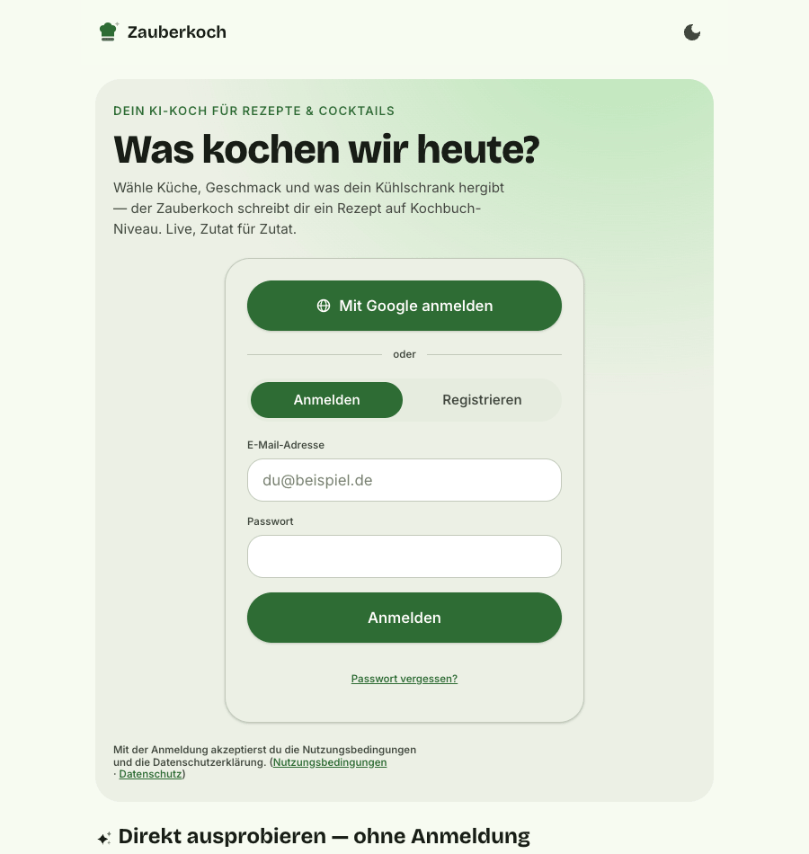</td>
<td width="50%">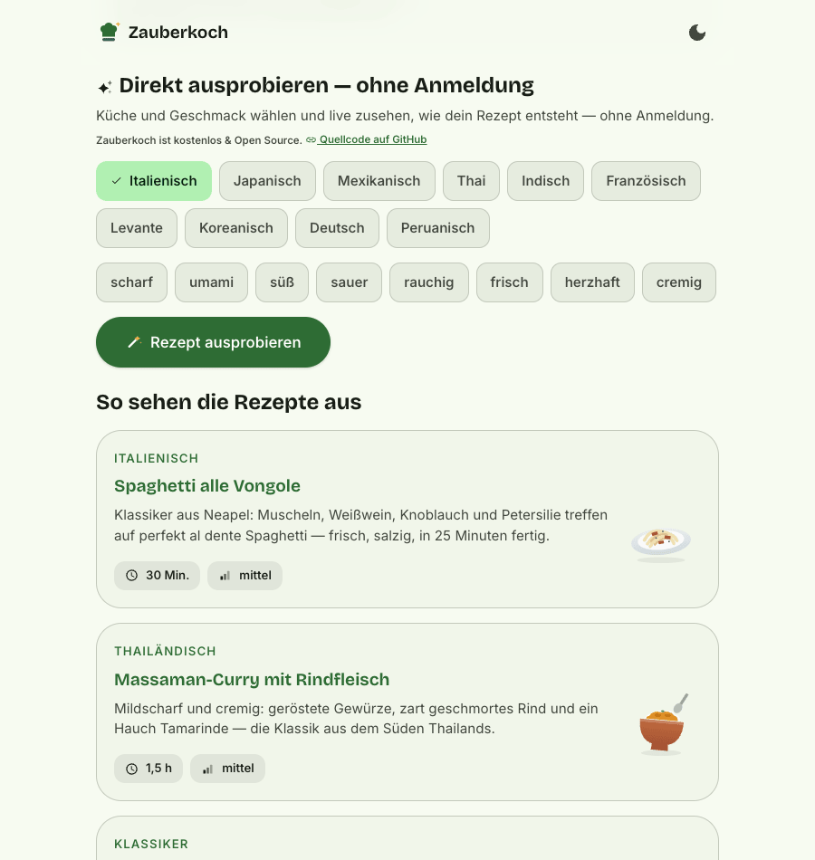</td>
</tr>
<tr>
<td align="center"><b>Arriving</b> — Google or email/password, both server-side.</td>
<td align="center"><b>Try without an account</b> — one recipe right on the landing page.</td>
</tr>
</table>

<table>
<tr>
<td width="33%">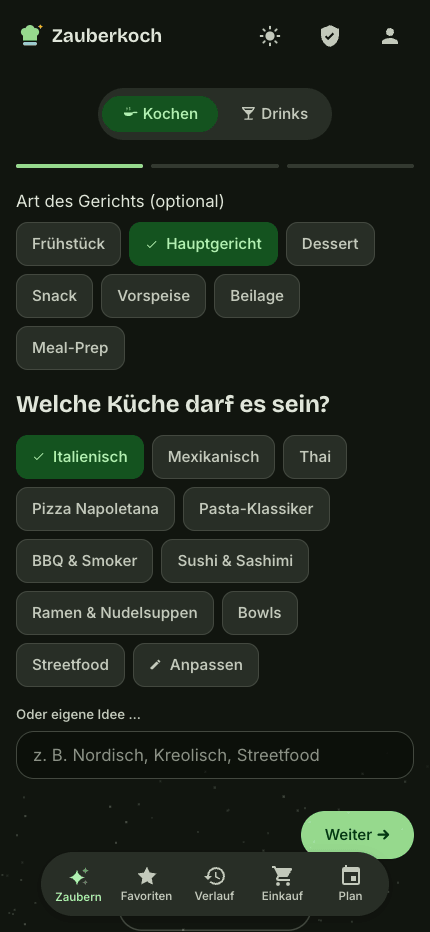</td>
<td width="33%">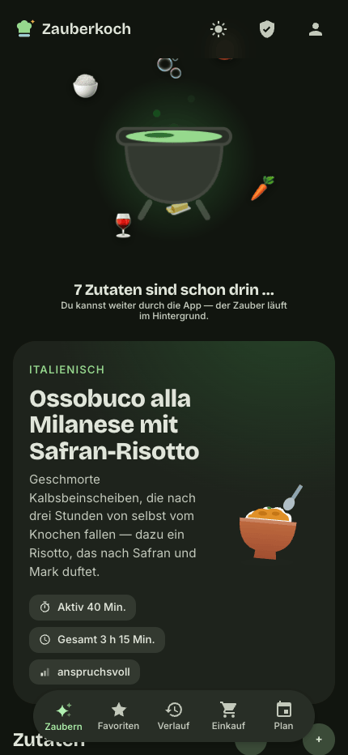</td>
<td width="33%">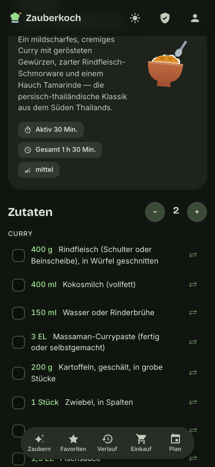</td>
</tr>
<tr>
<td align="center"><b>Wizard</b><br><sub>Meal type, cuisine, flavors — every step skippable</sub></td>
<td align="center"><b>The cauldron</b><br><sub>Ingredients orbit and drop in as they arrive</sub></td>
<td align="center"><b>Recipe</b><br><sub>Servings scale amounts live, ⇄ swaps an ingredient</sub></td>
</tr>
<tr>
<td width="33%">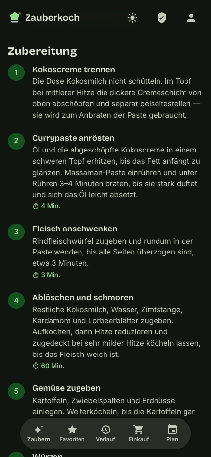</td>
<td width="33%">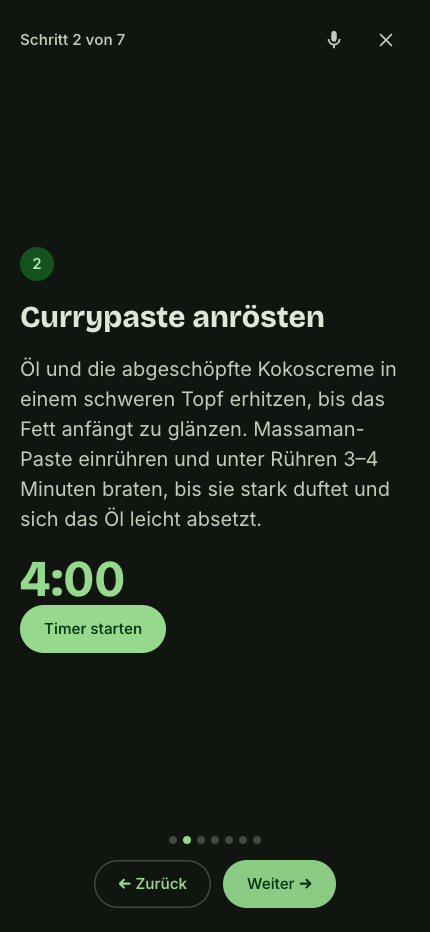</td>
<td width="33%">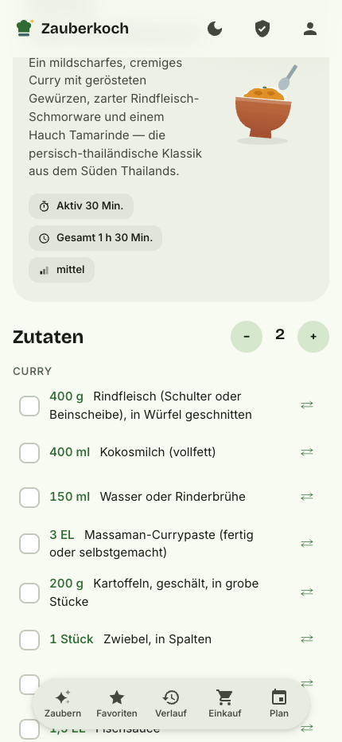</td>
</tr>
<tr>
<td align="center"><b>Steps</b><br><sub>Timers sit where they're needed</sub></td>
<td align="center"><b>Cook mode</b><br><sub>Fullscreen, wake lock, voice commands (🎙)</sub></td>
<td align="center"><b>Light theme</b><br><sub>Circular-reveal switch, same tokens</sub></td>
</tr>
<tr>
<td width="33%">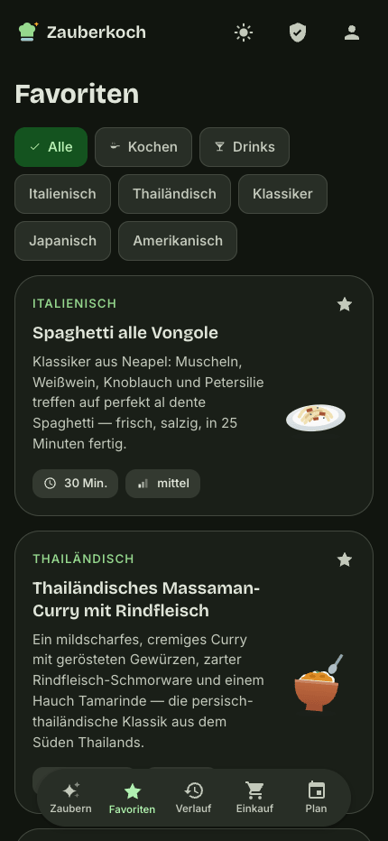</td>
<td width="33%">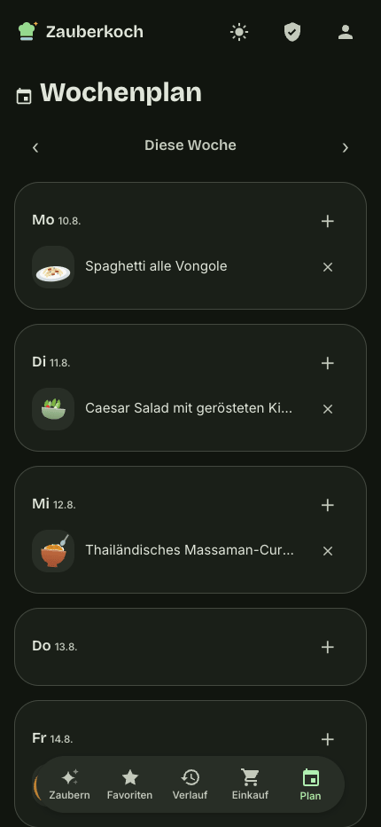</td>
<td width="33%">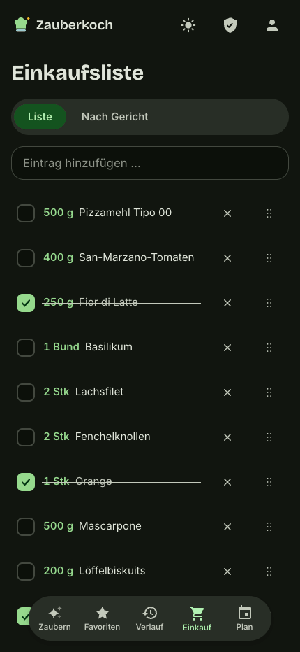</td>
</tr>
<tr>
<td align="center"><b>Favorites</b><br><sub>Filter by mode and cuisine, custom vector motifs</sub></td>
<td align="center"><b>Weekly plan</b><br><sub>Week → shopping list in one step</sub></td>
<td align="center"><b>Shopping</b><br><sub>Amounts aggregated, units normalized</sub></td>
</tr>
<tr>
<td width="33%">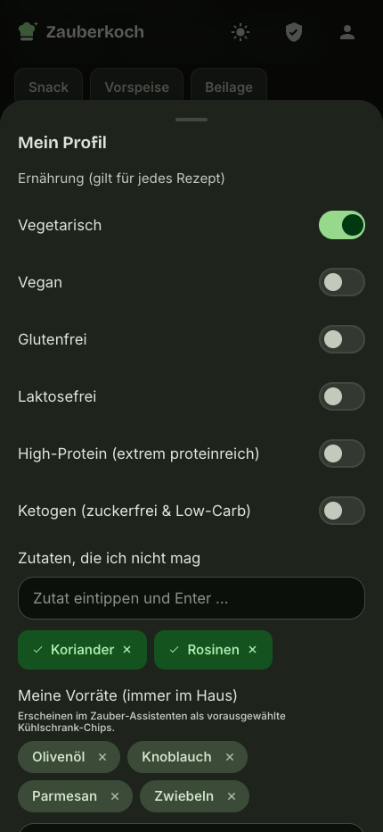</td>
<td width="33%">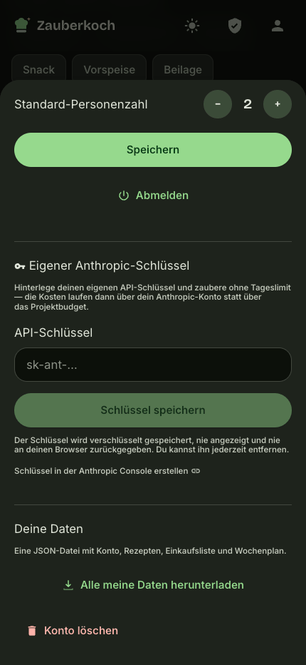</td>
<td width="33%">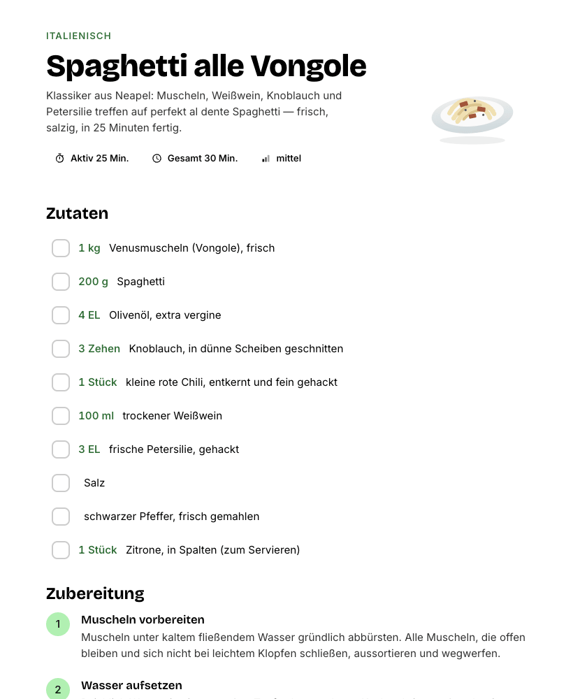</td>
</tr>
<tr>
<td align="center"><b>Profile</b><br><sub>Diet, no-gos and pantry apply to every recipe</sub></td>
<td align="center"><b>Own key & data</b><br><sub>BYOK, export, account deletion — all self-service</sub></td>
<td align="center"><b>Print</b><br><sub>A kitchen sheet without app chrome, black on white</sub></td>
</tr>
</table>

<table>
<tr>
<td width="50%">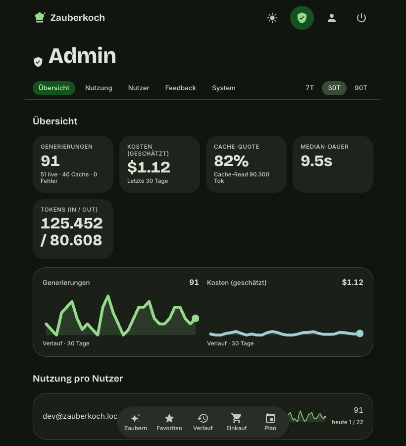</td>
<td width="50%">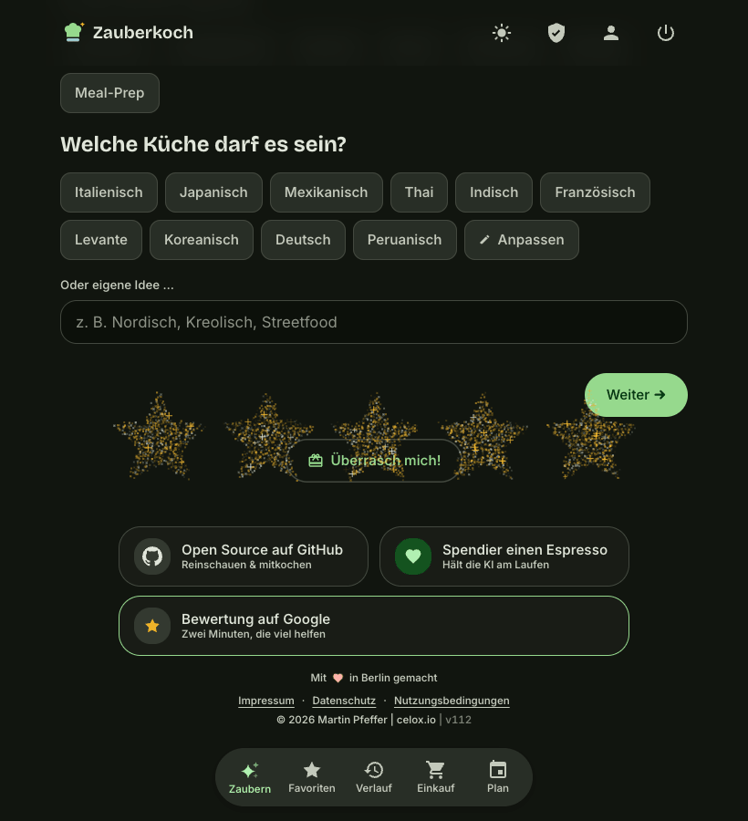</td>
</tr>
<tr>
<td align="center"><b>Admin</b> — generations, real cost, cache rate, limits.</td>
<td align="center"><b>Colophon</b> — the dust swarm condenses into a figure on hover.</td>
</tr>
</table>

<sub>Captured from a local instance with demo data. Three of the recipes shown are real generations from
the public gallery on zauberkoch.de.</sub>

## What it does

### Making recipes

- **Live streaming generation** — an incremental JSON parser turns the Claude token stream into semantic SSE events (title → ingredients → steps → tips); structured outputs and prompt caching keep it reliable and cheap
- **Magic cauldron** — while generating, the actual ingredients orbit a cauldron (or shaker in drinks mode) as emojis and drop in with spark bursts on every stream event; the title reveals word by word
- **Navigation-proof generation** — the stream lives in a global store and keeps running while you browse; a floating pill brings you back to the running or finished recipe
- **Three-step wizard**, fully skippable: meal type, cuisine (customizable chips), flavor chips, constraints (diet, time, difficulty, "what's in my fridge"), "surprise me"
- **Two modes** — cooking & drinks (incl. mocktails, cl measurements, shaken/stirred/built), with an animated color-scheme morph (basil ↔ violet)
- **Adapt on demand** — tweak any recipe via chips or free text ("spicier", "no oven", "meal-prep")
- **Fridge scan** — upload a photo, the vision model recognizes your ingredients and fills the fridge step
- **Ingredient substitution** — missing something? A small AI call suggests 2–3 realistic alternatives with quantity hints
- **Try without signing up** — generate one recipe right on the landing page (fair-use limited)

### Cooking, planning, shopping

- **Cook mode** — fullscreen, one step per screen, swipe navigation, built-in timers, wake lock, **voice control** ("weiter" / "zurück" / "beenden", Web Speech API)
- **Weekly planner** — drop recipes onto weekdays, "week → shopping list" aggregates everything in one step; every planned entry opens its recipe via container transform
- **Shopping list** — ingredients from several recipes are merged (units normalized: kg→g, cl→ml), drag reorder, sharing, undo everywhere
- **Servings stepper** with live-scaling amounts and rolling digits
- **Favorites & history** with search and filters by mode, cuisine and meal type
- **Preference profile** — diet, no-go ingredients, pantry staples and default servings merged into every generation
- **Per-recipe feedback** (with reason chips) feeding prompt iteration; personal cooking notes + a "cooked it" counter
- **Sharing** — unlisted links with server-rendered OG thumbnails (Pillow, 1200×630) and an optional intro animation; shared recipes can be adopted into your own collection
- **Print view** — a recipe as a kitchen sheet or PDF, black on white, without the app chrome; a written note comes along, an empty one does not

### Craft

- **Handmade Material 3 Expressive** — design tokens as CSS custom properties, no UI framework; real spring physics (Motion), `prefers-reduced-motion` on **every** animation
- **Shared-element navigation** — dish graphic and title morph into the detail view via **Material Container Transform** (native View Transitions API) — from the recipe list, the weekly planner and the shopping list; back reverses the morph, **including the browser back button on mobile**, all GPU-composited (`transform`/`opacity` only)
- **CRT on/off** — signing in blooms like a tube TV warming up, signing out collapses to scanline, dot and afterglow; theme-aware and reduced-motion-safe
- **Custom artwork instead of AI images** — 34 dish/glass categories across 58 flat vector motifs, 58 hand-drawn icon glyphs, not a single emoji in the UI (the cauldron excepted)
- **Colophon genie** — a canvas particle field lives in the footer; on hover the dust condenses into the Octocat, an espresso cup or five stars, and flows back when you leave
- **PWA** — installable, favorites readable offline, an unobtrusive offline indicator instead of error pages

### Your data stays yours

- **Two ways in** — Google OAuth (PKCE, server-side) **and** email/password (scrypt, double opt-in, password reset); httpOnly sessions, CSRF protection, per-account and global daily limits
- **Bring your own key** — optionally store your own Anthropic API key and generate without any daily cap; the key is stored AES-256-GCM encrypted, never displayed and never returned to the browser (only its last four characters)
- **Data export & account deletion in-app** — access and portability as one JSON file, deletion in one click (GDPR Art. 15/17/20, no email request needed)
- **No tracking, no analytics, no advertising cookies** — only the technically necessary session
- **Admin panel** — usage/cost dashboard (generations, tokens, cache rate, median duration, feedback per prompt version) plus limits, a registration switch and the allowlist, gated via `ZK_ADMIN_EMAILS`

## How it works

### From click to recipe

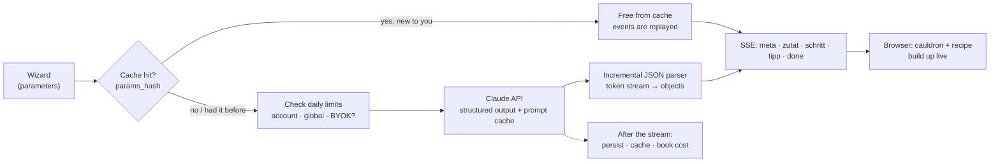

The heart of it is the **incremental parser** (`services/json_stream.py`): Claude emits *one* JSON object
as a token stream, but nobody wants to wait 20 seconds for the closing brace. The parser spots finished
sub-objects inside the half-written JSON and dispatches them immediately as semantic events — which is
why an ingredient appears the moment the model finishes writing it.

Generation lives in a **global store outside React**. Switching to the shopping list mid-generation
interrupts nothing; a floating pill leads back.

### What keeps it cheap

A recipe costs real money (~3–4 cents). Four mechanisms keep that small without feeling stingy:

| Mechanism | What it does |
|---|---|
| **Generation cache** | Identical parameters hit the cache — free for *other* users and after errors. Serving size is deliberately **not** part of the key: it is scaled server-side. |
| **Dedup instead of repetition** | Sending the *same* parameters again means you already have that recipe. The server switches to a variation automatically and appends an avoid list of your last 40 titles — word-order and spelling invariant, so "Der klassische Daiquiri" is recognized as "Daiquiri". |
| **Prompt caching** | The system prompt is identical across requests and cached at Anthropic (0.1× multiplier on cached input tokens). |
| **Daily limits** | Per account, globally and for anonymous taster generations — all three editable at runtime in the admin panel, no deploy needed. |

The cost calculation itself knows **prices per model and per effective date** (`services/pricing.py`):
every generation is valued at the price that applied on its day. Otherwise any 30-day window spanning a
price change would be wrong.

### Security, briefly

- `ANTHROPIC_API_KEY` stays server-side; scoring, limits and validation happen in the backend only.
- Auth tokens live in httpOnly cookies, **never** in `localStorage`; state-changing requests require a CSRF token.
- Passwords: `scrypt` with a random salt and a self-describing format. Verify and reset links are **stateless** (HMAC) — the reset link is bound to the password hash and therefore dies after a single use.
- Registration and login are enumeration-safe: the same answer whether or not the account exists.
- Stored third-party API keys: AES-256-GCM, wrapping key via HKDF. An unreadable entry counts as "no key" instead of locking the account out.

## Stack

| Layer | Technology |
|---|---|
| Backend | Python 3.12 · FastAPI · SQLite (WAL) · SQLAlchemy 2 · Pydantic v2 · Alembic |
| AI | Anthropic API (`claude-sonnet-5`, swappable via `ANTHROPIC_MODEL`) · streaming · structured outputs · prompt caching |
| Frontend | React 19 · Vite · TypeScript (strict) · TanStack Query · Motion |
| Styling | Material 3 Expressive — **handmade** as CSS custom properties, no MUI/Ant |
| Auth | Google OAuth 2.0 (authorization code + PKCE) · email/password (scrypt) · httpOnly cookies |
| Crypto | scrypt (passwords) · HMAC (stateless tokens) · AES-256-GCM (stored API keys) |
| Tests | pytest · Vitest · Playwright |
| Deploy | systemd + nginx (SSE-capable) · Let's Encrypt · **no Docker in production** |

## Project layout

```
backend/                 ~5,500 lines of Python (+ ~3,500 lines of tests)
  app/api/v1/            auth · recipes · favorites · shopping · plan · share · me · admin · health
  app/core/              config (pydantic-settings) · security · logging
  app/models/            users · sessions · recipes · favorites · shopping · plan
                         generation_cache · generations · app_settings · allowlist · rate_limits
  app/schemas/           Recipe (the recipe JSON schema) · GenerateParams · Preferences · auth
  app/services/          ai (streaming) · json_stream (incremental parser) · cache · ratelimit
                         limits · pricing · byok · secretbox · passwords · auth_tokens
                         aggregation · og_image · titles · mailer · google_oauth
  app/prompts/           recipe_v1 … recipe_v5 — VERSIONED, the core of the product
  alembic/versions/      16 migrations (never change the schema without one)
  scripts/               allowlist · stats · smoke_ai · showcase · email_preview
  tests/                 248 tests

frontend/                ~16,500 lines of TS/TSX/CSS
  src/styles/tokens.css  M3 color schemes (cooking = green, drinks = violet) × light/dark
  src/motion/            spring tokens — no magic numbers in components
  src/i18n/de.ts         ALL UI strings, aria labels included
  src/features/          wizard · recipe · cook-mode · favorites · shopping · plan · auth · share
  src/components/        icons (58 glyphs) · recipe (58 motifs) · colophon (particle field) · ui
  src/state/             generation (SSE store outside React) · theme · supportPrompt
  e2e/                   13 Playwright tests

deploy/                  systemd unit · nginx vhost · deploy.sh · backup timer
docs/                    DEPLOY · GOOGLE-OAUTH · MOTION · IOS-CHECKLIST · screenshots/
.claude/rules/           binding project rules (M3E canon, motion, frontend)
```

## Quickstart

```bash
cp .env.example backend/.env      # set ANTHROPIC_API_KEY, ZK_DEV_LOGIN=true
docker compose -f docker-compose.dev.yml up
# → http://localhost:5173 → "Dev-Login (lokal)" — no Google client needed
```

Native setup:

```bash
# Backend
cd backend
python3.12 -m venv .venv && source .venv/bin/activate
pip install -r requirements-dev.txt
cp ../.env.example .env
alembic upgrade head
python -m scripts.allowlist add you@example.com
uvicorn app.main:app --reload --port 8742

# Frontend (second terminal)
cd frontend
npm install
npm run dev                    # http://localhost:5173, /api proxied to :8742
```

Google OAuth setup: [`docs/GOOGLE-OAUTH.md`](docs/GOOGLE-OAUTH.md) · deployment: [`docs/DEPLOY.md`](docs/DEPLOY.md)

## Tests

```bash
cd backend  && pytest                    # 248 tests
cd backend  && pytest --cov=app          # 94 % statement coverage
cd frontend && npm test                  # 126 tests (Vitest)
cd frontend && npx playwright test       # 13 E2E tests (local)
```

**374 unit/integration tests plus 13 E2E tests run on every push** via
[GitHub Actions](.github/workflows/ci.yml). **No test ever calls the real Anthropic API.**

Covered, among other things: auth (Google **and** email/password), rate limits and the registration cap,
cache and dedup, the incremental SSE parser, AI orchestration, the prompt versions, sharing and OG
rendering, the cost model with its price effective dates, account export and deletion, and the BYOK
encryption.

Frontend unit coverage sits at ~21 % project-wide — deliberately: the tests target the logic layer
(`lib`/`state`/`i18n`), the React surface belongs to Playwright.

**The security-critical parts are asserted twice over.** Account deletion checks *every* affected table
individually instead of trusting `ON DELETE CASCADE` (SQLite only enforces foreign keys while
`PRAGMA foreign_keys=ON` is set). The BYOK tests explicitly assert that neither `/me` nor the data export
ever contains a key in plaintext. And the race "account deleted while a generation is in flight" is
reproduced for real — the test fails without the guard.

## Quality & numbers

| Measurement | Value | As of |
|---|---|---|
| Lighthouse (performance / a11y / best practices / SEO) | **99 / 100 / 100 / 100** | against production, 2026-07-11 |
| Backend coverage (statements) | **94 %** | 2026-08-15 |
| Tests | **248** backend · **126** frontend · **13** E2E | 2026-08-15 |
| Cost per live generation | ~3–4 cents | Sonnet 5, measured |

Non-negotiable when changing things: touch targets ≥ 48 px, a visible `:focus-visible`, contrast ≥ AA,
`prefers-reduced-motion` on every animation, no hardcoded UI strings, no hex values in components.

## Deployment

Production runs without Docker: one systemd service for the backend (port 8742, loopback), the Vite build
served statically by nginx, TLS from Let's Encrypt. The SSE endpoint needs `proxy_buffering off` and long
timeouts — otherwise nginx buffers the stream and the live build-up turns into a jump to the end.

```bash
./deploy/deploy.sh                    # tests → build → rsync → restart → health check
```

Details, nginx vhost and backup timer: [`docs/DEPLOY.md`](docs/DEPLOY.md).

## Documentation map

| File | Contents |
|---|---|
| [`CLAUDE.md`](CLAUDE.md) | Architecture memory: decisions, pitfalls, conventions (German) |
| [`docs/DEPLOY.md`](docs/DEPLOY.md) | First-time server setup, nginx, backups |
| [`docs/GOOGLE-OAUTH.md`](docs/GOOGLE-OAUTH.md) | Creating the OAuth client, redirect URIs |
| [`docs/MOTION.md`](docs/MOTION.md) | Motion quick reference (springs, view transitions) |
| [`docs/IOS-CHECKLIST.md`](docs/IOS-CHECKLIST.md) | PWA quirks on iOS |
| [`ILLUSTRATION_STYLE.md`](ILLUSTRATION_STYLE.md) | Style spec for icons and card motifs |
| [`.claude/rules/`](.claude/rules/) | Binding rules: M3E canon, motion, frontend |
| [`CONTRIBUTING.md`](CONTRIBUTING.md) · [`SECURITY.md`](SECURITY.md) | Contributions and reporting |

## Contributing

Contributions are welcome — see [CONTRIBUTING.md](CONTRIBUTING.md). Please get `pytest` and `npm test`
green before opening a PR; CI insists on it. Security issues: **not** as an issue, please use
[SECURITY.md](SECURITY.md).

A good first contribution is a new card motif. The style is described in
[`ILLUSTRATION_STYLE.md`](ILLUSTRATION_STYLE.md), and `.claude/skills/recipe-motifs/` walks through
creating and registering one.

## Support the project

Zauberkoch is a hobby project paid for out of my own pocket — every generation costs real money. If you
like it:

<div align="center">

[](https://www.paypal.com/donate/?business=martin.pfeffer%40celox.io&currency_code=EUR)
[](https://g.page/r/CXgdRV3QysvxEBM/review)

</div>

A star here on GitHub helps too — and costs nothing.

## License & credits

[MIT](LICENSE) © 2026 Martin Pfeffer | [celox.io](https://celox.io)

Fonts: [Inter](https://rsms.me/inter/) and [Bricolage Grotesque](https://github.com/ateliertriay/bricolage)
(SIL Open Font License). Built with [Claude Code](https://claude.com/claude-code).
