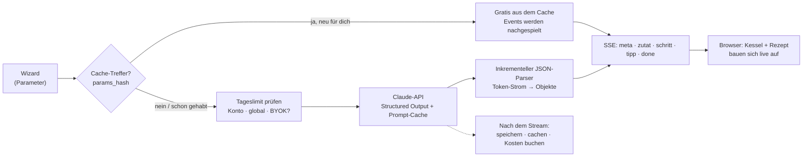

<div align="center">

# Zauberkoch 🧑‍🍳🍸

**Sag, worauf du Lust hast — die KI schreibt das Rezept, und du siehst ihm beim Entstehen zu.**

[](https://github.com/pepperonas/zauberkoch-pwa/actions/workflows/ci.yml)
[](#tests)
[](#tests)
[](#qualität--messwerte)
[](https://zauberkoch.de)
[](LICENSE)

[](https://github.com/pepperonas/zauberkoch-pwa/commits/main)
[](#projektstruktur)
[](#stack)
[](https://github.com/pepperonas/zauberkoch-pwa/issues)
[](https://github.com/pepperonas/zauberkoch-pwa/stargazers)
[](https://github.com/pepperonas/zauberkoch-pwa/network/members)
[](CONTRIBUTING.md)

[](backend/)
[](backend/app/main.py)
[](backend/app/models/models.py)
[](backend/app/models/)
[](backend/alembic/versions/)
[](https://www.anthropic.com)

[](frontend/)
[](frontend/tsconfig.json)
[](frontend/vite.config.ts)
[](frontend/src/lib/api.ts)
[](frontend/src/motion/tokens.ts)
[](frontend/src/styles/tokens.css)

[](frontend/public/sw.js)
[](frontend/src/pages/legal)
[](#daten-die-dir-gehören)
[](https://claude.com/claude-code)
[](https://www.paypal.com/donate/?business=martin.pfeffer%40celox.io&currency_code=EUR)

**[🌐 zauberkoch.de](https://zauberkoch.de)** · **[🇬🇧 English](README.en.md)** · **[📸 Screenshots](#screenshots)** · **[🧠 So funktioniert's](#so-funktionierts)** · **[🤝 Mitmachen](CONTRIBUTING.md)**

</div>

---

Küche wählen, Geschmack wählen, Rahmenbedingungen setzen — der Zauberkoch schreibt ein Rezept auf
Kochbuch-Niveau mit exakten Mengen. Das Rezept **baut sich live vor deinen Augen auf** (SSE-Streaming,
kein Spinner-Gefängnis): erst Titel und Teaser, dann Zutat für Zutat, dann die Schritte. Dahinter steckt
kein Wrapper um einen Chat-Endpunkt, sondern ein inkrementeller JSON-Parser über dem Token-Strom, ein
Cache, der Wiederholungen gratis macht, und ein Kostendeckel, der auch dann hält, wenn jemand den
Zauber-Knopf liebt.

Das Projekt ist ein Hobby-Projekt und komplett Open Source — Prompts, Kostenmodell und Limits inklusive.

## Inhalt

- [Screenshots](#screenshots)
- [Was die App kann](#was-die-app-kann)
- [So funktioniert's](#so-funktionierts)
- [Stack](#stack)
- [Projektstruktur](#projektstruktur)
- [Lokales Setup](#lokales-setup)
- [Tests](#tests)
- [Qualität & Messwerte](#qualität--messwerte)
- [Deployment](#deployment)
- [Doku-Wegweiser](#doku-wegweiser)
- [Mitmachen](#mitmachen)
- [Unterstützen](#unterstützen)
- [Lizenz & Credits](#lizenz--credits)

## Screenshots

<table>
<tr>
<td width="50%"></td>
<td width="50%"></td>
</tr>
<tr>
<td align="center"><b>Ankommen</b> — Google oder E-Mail/Passwort, beides server-seitig.</td>
<td align="center"><b>Probieren ohne Konto</b> — ein Rezept direkt auf der Landing-Page.</td>
</tr>
</table>

<table>
<tr>
<td width="33%"></td>
<td width="33%"></td>
<td width="33%"></td>
</tr>
<tr>
<td align="center"><b>Wizard</b><br><sub>Gericht-Art, Küche, Geschmack — jeder Schritt überspringbar</sub></td>
<td align="center"><b>Der Kessel</b><br><sub>Zutaten kreisen und fallen hinein, während sie eintreffen</sub></td>
<td align="center"><b>Rezept</b><br><sub>Portionen skalieren die Mengen live, ⇄ tauscht Zutaten</sub></td>
</tr>
<tr>
<td width="33%"></td>
<td width="33%"></td>
<td width="33%"></td>
</tr>
<tr>
<td align="center"><b>Schritte</b><br><sub>Timer stehen da, wo sie gebraucht werden</sub></td>
<td align="center"><b>Koch-Modus</b><br><sub>Vollbild, Wake Lock, Sprachbefehle (🎙)</sub></td>
<td align="center"><b>Helles Design</b><br><sub>Circular-Reveal-Wechsel, dieselben Tokens</sub></td>
</tr>
<tr>
<td width="33%"></td>
<td width="33%"></td>
<td width="33%"></td>
</tr>
<tr>
<td align="center"><b>Favoriten</b><br><sub>Filter nach Modus und Küche, eigene Vektor-Motive</sub></td>
<td align="center"><b>Wochenplan</b><br><sub>Woche → Einkaufsliste in einem Schritt</sub></td>
<td align="center"><b>Einkauf</b><br><sub>Mengen aggregiert, Einheiten normalisiert</sub></td>
</tr>
<tr>
<td width="33%"></td>
<td width="33%"></td>
<td width="33%"></td>
</tr>
<tr>
<td align="center"><b>Profil</b><br><sub>Ernährung, No-Gos und Vorräte gelten für jedes Rezept</sub></td>
<td align="center"><b>Eigener Schlüssel & Daten</b><br><sub>BYOK, Export, Konto-Löschung — alles selbstbedient</sub></td>
<td align="center"><b>Drucken</b><br><sub>Küchenblatt ohne App-Rahmen, schwarz auf weiß</sub></td>
</tr>
</table>

<table>
<tr>
<td width="50%"></td>
<td width="50%"></td>
</tr>
<tr>
<td align="center"><b>Admin</b> — Generierungen, echte Kosten, Cache-Quote, Limits.</td>
<td align="center"><b>Kolophon</b> — der Punkte-Schwarm kondensiert beim Hovern zur Figur.</td>
</tr>
</table>

<sub>Aufgenommen aus einer lokalen Instanz mit Demo-Daten. Drei der gezeigten Rezepte sind echte
Generierungen aus der öffentlichen Galerie von zauberkoch.de.</sub>

## Was die App kann

### Rezepte entstehen lassen

- 🪄 **Live-Streaming-Generierung** — semantische SSE-Events (Titel → Zutaten → Schritte → Tipps) aus einem inkrementellen JSON-Parser über der Claude-API (Structured Outputs, Prompt-Caching, disconnect-fest)
- 🧙 **Magischer Kessel** — während der Generierung kreisen die echten Zutaten als Emojis um einen Kessel (bzw. Shaker im Drinks-Modus) und fallen bei jedem Stream-Event mit Funken-Burst hinein; der Titel materialisiert Wort für Wort
- 🔄 **Navigationsfeste Generierung** — der Stream lebt in einem globalen Store und läuft beim Seitenwechsel weiter; eine schwebende Status-Pille („🪄 Rezept wird gezaubert …" → „✨ fertig!") führt jederzeit zurück
- 🧙 **3-Schritt-Wizard**, komplett überspringbar: Gericht-Art, Länderküche (personalisierbare Chips), Geschmacks-Chips, Constraints (Diät, Zeit, Schwierigkeit, „Was hab ich im Kühlschrank"), „Überrasch mich"
- 🍳/🍸 **Zwei Modi** — Kochen & Drinks (inkl. Mocktails, cl-Angaben, shaken/stirred/built), mit animiertem Farbschema-Morph (Basilikum ↔ Violett)
- ✨ **Anpassen per Zuruf** — jedes Rezept per Chip oder Freitext abwandeln („schärfer", „ohne Ofen", „für Meal-Prep")
- 📷 **Kühlschrank-Scan** — Foto hochladen, die Vision-KI erkennt die Zutaten und füllt den Kühlschrank-Schritt
- 🔁 **Zutaten-Ersatz** — fehlt eine Zutat, liefert ein Mini-KI-Call 2–3 realistische Alternativen mit Mengen-Hinweis
- ✨ **Probier-Zauber** — ein Rezept direkt auf der Landing-Page generieren, ganz ohne Anmeldung (fair-use-limitiert)

### Kochen, planen, einkaufen

- 📱 **Koch-Modus** — Vollbild, ein Schritt pro Screen, Swipe-Navigation, integrierte Timer, Wake Lock, **Sprachsteuerung** („weiter" / „zurück" / „beenden", Web Speech API)
- 📅 **Wochenplaner** — Rezepte auf Wochentage legen, „Woche → Einkaufsliste" aggregiert alles in einem Schritt; jeder Plan-Eintrag öffnet sein Rezept per Container-Transform
- 🛒 **Einkaufsliste** — Zutaten mehrerer Rezepte werden zusammengeführt (Einheiten normalisiert: kg→g, cl→ml), Drag-Reorder, Teilen, überall Undo
- 🔢 **Portionen-Stepper** mit live skalierenden Mengen und rollenden Ziffern
- ⭐ **Favoriten & Verlauf** mit Suche und Filtern nach Modus, Küche und Gericht-Art
- 👤 **Präferenz-Profil** — Ernährungsform, No-Go-Zutaten, Vorräte und Standard-Personenzahl fließen automatisch in jede Generierung
- 👍 **Feedback pro Rezept** (mit Grund-Chips) — fließt in die Prompt-Iteration; 📝 persönliche Koch-Notizen + „Gekocht"-Zähler
- 🔗 **Teilen** — unlisted Links mit server-seitig gerenderten OG-Thumbnails (Pillow, 1200×630) und optionaler Intro-Animation; geteilte Rezepte können in die eigene Sammlung übernommen werden
- 🖨️ **Druckansicht** — Rezept als Küchenblatt oder PDF, schwarz auf weiß, ohne App-Rahmen; geschriebene Notizen kommen mit, leere Felder nicht

### Handwerk

- 🎨 **Material 3 Expressive, handgebaut** — Design-Tokens als CSS Custom Properties, kein UI-Framework; echte Spring-Physik (Motion), `prefers-reduced-motion` auf **jeder** Animation
- 🎞️ **Shared-Element-Navigation** — Grafik und Titel wandern per **Material Container Transform** (native View Transitions API) in die Detailansicht — aus Rezeptliste, Wochenplaner und Einkaufsliste; Zurück morpht zurück, **auch der Browser-Back-Button auf Mobile**, alles GPU-composited (nur `transform`/`opacity`)
- 📺 **CRT-An/Aus** — der Login blüht wie eine Röhre auf, der Logout kollabiert zu Scanline, Punkt und Ausglühen; theme-bewusst und reduced-motion-fest
- 🖌️ **Eigene Bildsprache statt KI-Bilder** — 34 Gericht-/Glas-Kategorien in 58 flachen Vektor-Motiven, 58 handgezeichnete Icon-Glyphen, kein einziges Emoji in der UI (Ausnahme: der Kessel)
- ✨ **Kolophon-Genie** — im Footer treibt ein Canvas-Partikelfeld; beim Hovern kondensiert der Staub zu Octocat, Espressotasse oder fünf Sternen und fließt beim Verlassen zurück
- 📲 **PWA** — installierbar, Favoriten offline lesbar, unaufdringlicher Offline-Indikator statt Fehlerseiten

### Daten, die dir gehören

- 🔐 **Zwei Anmeldewege** — Google OAuth (PKCE, server-seitig) **und** E-Mail/Passwort (scrypt, Double-Opt-in, Passwort-Reset); httpOnly-Sessions, CSRF-Schutz, Tageslimits pro Konto und global
- 🔑 **Eigener Anthropic-Schlüssel (BYOK)** — optional den eigenen API-Key hinterlegen und ohne Tageslimit zaubern; der Schlüssel wird AES-256-GCM-verschlüsselt gespeichert, nie angezeigt und nie an den Browser zurückgegeben (nur die letzten vier Zeichen)
- 📤 **Datenexport & Konto-Löschung in der App** — Auskunft und Übertragbarkeit als eine JSON-Datei, Löschung mit einem Klick (DSGVO Art. 15/17/20, ohne E-Mail-Anfrage)
- 🚫 **Kein Tracking, keine Analytics, keine Werbe-Cookies** — nur die technisch notwendige Session
- 🛡️ **Admin-Panel** — Nutzungs-/Kosten-Dashboard (Generierungen, Tokens, Cache-Quote, Median-Dauer, Feedback pro Prompt-Version) + Limits, Registrierungs-Schalter und Allowlist, per `ZK_ADMIN_EMAILS` freigeschaltet

## So funktioniert's

### Vom Klick zum Rezept



Das Herzstück ist der **inkrementelle Parser** (`services/json_stream.py`): Claude liefert *ein* JSON-Objekt
als Token-Strom, aber niemand will 20 Sekunden auf die schließende Klammer warten. Der Parser erkennt
fertige Teilobjekte im halbfertigen JSON und schickt sie sofort als semantisches Event los — deshalb
erscheint eine Zutat in dem Moment, in dem das Modell sie zu Ende geschrieben hat.

Die Generierung läuft in einem **globalen Store außerhalb von React**. Wer währenddessen in die
Einkaufsliste wechselt, unterbricht nichts; eine schwebende Pille führt zurück.

### Was Geld spart

Ein Rezept kostet echtes Geld (~3–4 ct). Vier Mechanismen halten das klein, ohne dass es sich karg anfühlt:

| Mechanismus | Was er tut |
|---|---|
| **Generation-Cache** | Identische Parameter treffen den Cache — für *andere* Nutzer und nach Fehlern gratis. Die Personenzahl ist bewusst **nicht** Teil des Schlüssels: sie wird server-seitig hochgerechnet. |
| **Dedup statt Wiederholung** | Wer *dieselben* Parameter erneut schickt, hat das Rezept schon. Der Server schaltet automatisch auf Variation und hängt eine Vermeidungsliste der letzten 40 Titel an — wortstellungs- und schreibweisen-invariant, damit „Der klassische Daiquiri" als „Daiquiri" erkannt wird. |
| **Prompt-Caching** | Der System-Prompt ist über alle Anfragen identisch und wird bei Anthropic zwischengespeichert (Faktor 0,1 auf gecachte Eingabe-Tokens). |
| **Tageslimits** | Pro Konto, global und für anonyme Probier-Zauber — alle drei zur Laufzeit im Admin-Panel änderbar, ohne Deploy. |

Die Kostenrechnung selbst kennt **Preise je Modell und je Stichtag** (`services/pricing.py`): jede
Generierung wird mit dem Preis bewertet, der an ihrem Tag galt. Sonst wäre jedes 30-Tage-Fenster über
einer Preisänderung hinweg falsch.

### Sicherheit, kurz

- `ANTHROPIC_API_KEY` bleibt server-seitig; Scoring, Limits und Validierung passieren nur im Backend.
- Auth-Tokens liegen in httpOnly-Cookies, **nie** in `localStorage`; state-changing Requests brauchen ein CSRF-Token.
- Passwörter: `scrypt` mit Zufalls-Salt und selbstbeschreibendem Format. Verify-/Reset-Links sind **zustandslos** (HMAC) — der Reset-Link ist an den Passwort-Hash gebunden und stirbt damit nach einmaliger Nutzung.
- Registrierung und Login sind enumeration-safe: gleiche Antwort, ob es das Konto gibt oder nicht.
- Hinterlegte Fremd-API-Schlüssel: AES-256-GCM, Wrapping-Key per HKDF. Ein unlesbarer Eintrag zählt als „kein Schlüssel", statt das Konto zu blockieren.

## Stack

| Layer | Technologie |
|---|---|
| Backend | Python 3.12 · FastAPI · SQLite (WAL) · SQLAlchemy 2 · Pydantic v2 · Alembic |
| KI | Anthropic API (`claude-sonnet-5`, per `ANTHROPIC_MODEL` tauschbar) · Streaming · Structured Outputs · Prompt-Caching |
| Frontend | React 19 · Vite · TypeScript (strict) · TanStack Query · Motion |
| Styling | Material 3 Expressive — **handgebaut** als CSS Custom Properties, kein MUI/Ant |
| Auth | Google OAuth 2.0 (Authorization Code + PKCE) · E-Mail/Passwort (scrypt) · httpOnly-Cookies |
| Krypto | scrypt (Passwörter) · HMAC (zustandslose Tokens) · AES-256-GCM (hinterlegte API-Schlüssel) |
| Tests | pytest · Vitest · Playwright |
| Deploy | systemd + nginx (SSE-tauglich) · Let's Encrypt · **kein Docker in Produktion** |

## Projektstruktur

```
backend/                 ~5.500 Zeilen Python (+ ~3.500 Zeilen Tests)
  app/api/v1/            auth · recipes · favorites · shopping · plan · share · me · admin · health
  app/core/              config (pydantic-settings) · security · logging
  app/models/            users · sessions · recipes · favorites · shopping · plan
                         generation_cache · generations · app_settings · allowlist · rate_limits
  app/schemas/           Recipe (das Rezept-JSON-Schema) · GenerateParams · Preferences · auth
  app/services/          ai (Streaming) · json_stream (inkrementeller Parser) · cache · ratelimit
                         limits · pricing · byok · secretbox · passwords · auth_tokens
                         aggregation · og_image · titles · mailer · google_oauth
  app/prompts/           recipe_v1 … recipe_v5 — VERSIONIERT, das Kernstück
  alembic/versions/      16 Migrationen (nie Schema ohne Migration ändern)
  scripts/               allowlist · stats · smoke_ai · showcase · email_preview
  tests/                 248 Tests

frontend/                ~16.500 Zeilen TS/TSX/CSS
  src/styles/tokens.css  M3-Farbschemata (Kochen=Grün, Drinks=Violett) × Light/Dark
  src/motion/            Spring-Tokens — keine Magic Numbers in Komponenten
  src/i18n/de.ts         ALLE UI-Strings, auch aria-Labels
  src/features/          wizard · recipe · cook-mode · favorites · shopping · plan · auth · share
  src/components/        icons (58 Glyphen) · recipe (58 Motive) · colophon (Partikelfeld) · ui
  src/state/             generation (SSE-Store außerhalb von React) · theme · supportPrompt
  e2e/                   13 Playwright-Tests

deploy/                  systemd-Unit · nginx-vHost · deploy.sh · Backup-Timer
docs/                    DEPLOY · GOOGLE-OAUTH · MOTION · IOS-CHECKLIST · screenshots/
.claude/rules/           verbindliche Projektregeln (M3E-Kanon, Motion, Frontend)
```

## Lokales Setup

**Schnellster Weg (Docker, ohne Google-Client):**

```bash
cp .env.example backend/.env      # ANTHROPIC_API_KEY eintragen, ZK_DEV_LOGIN=true
docker compose -f docker-compose.dev.yml up
# → http://localhost:5173 → „Dev-Login (lokal)"
```

**Nativ:**

```bash
# Backend
cd backend
python3.12 -m venv .venv && source .venv/bin/activate
pip install -r requirements-dev.txt
cp ../.env.example .env        # ANTHROPIC_API_KEY, Google-Creds, SESSION_SECRET eintragen
alembic upgrade head
python -m scripts.allowlist add du@example.com
uvicorn app.main:app --reload --port 8742

# Frontend (zweites Terminal)
cd frontend
npm install
npm run dev                    # http://localhost:5173, /api → Proxy auf :8742
```

Nützliche Skripte:

```bash
python -m scripts.stats [tage]     # Usage, Kosten, Cache-Quote, Feedback
python -m scripts.smoke_ai         # EINE echte Generierung (kostet Tokens)
npm run gen:assets                 # Favicon/PWA/OG aus dem Chef-Hut-Logo
npm run measure:motifs             # QA: Bounding-Box je Karten-Motiv
```

Google-OAuth-Einrichtung: [`docs/GOOGLE-OAUTH.md`](docs/GOOGLE-OAUTH.md) · Deployment: [`docs/DEPLOY.md`](docs/DEPLOY.md)

## Tests

```bash
cd backend  && pytest                    # 248 Tests
cd backend  && pytest --cov=app          # 94 % Statement-Coverage
cd frontend && npm test                  # 126 Tests (Vitest)
cd frontend && npx playwright test       # 13 E2E-Tests (lokal)
```

**374 Unit-/Integrationstests plus 13 E2E-Tests laufen bei jedem Push** als
[GitHub Action](.github/workflows/ci.yml). **Kein Test ruft die echte Anthropic-API auf.**

Abgedeckt sind unter anderem: Auth (Google **und** E-Mail/Passwort), Rate-Limits und Registrierungs-Cap,
Cache und Dedup, der inkrementelle SSE-Parser, die KI-Orchestrierung, die Prompt-Versionen, Share und
OG-Rendering, das Kostenmodell mit Preis-Stichtagen, Konto-Export und -Löschung sowie die
BYOK-Verschlüsselung.

Die Unit-Coverage im Frontend liegt projektweit bei ~21 % — bewusst: die Tests decken die Logik-Schicht
(`lib`/`state`/`i18n`) ab, die React-Oberfläche gehört zu Playwright.

**Sicherheitskritisches ist doppelt abgesichert.** Die Konto-Löschung prüft *jede* betroffene Tabelle
einzeln, statt auf `ON DELETE CASCADE` zu vertrauen (SQLite erzwingt Fremdschlüssel nur mit
`PRAGMA foreign_keys=ON`). Die BYOK-Tests behaupten explizit, dass weder `/me` noch der Datenexport je
einen Schlüssel im Klartext enthalten. Und das Rennen „Konto wird gelöscht, während eine Generierung
läuft" wird echt nachgestellt — der Test schlägt ohne den Guard fehl.

## Qualität & Messwerte

| Messung | Wert | Stand |
|---|---|---|
| Lighthouse (Performance / A11y / Best Practices / SEO) | **99 / 100 / 100 / 100** | gegen Produktion, 2026-07-11 |
| Backend-Coverage (Statements) | **94 %** | 2026-08-15 |
| Tests | **248** Backend · **126** Frontend · **13** E2E | 2026-08-15 |
| Kosten je Live-Generierung | ~3–4 ct | Sonnet 5, gemessen |

Nicht verhandelbar bei Änderungen: Touch-Targets ≥ 48 px, sichtbarer `:focus-visible`, Kontrast ≥ AA,
`prefers-reduced-motion` auf jeder Animation, keine hartcodierten UI-Strings, keine Hex-Werte in
Komponenten.

## Deployment

Produktion läuft ohne Docker: ein systemd-Service für das Backend (Port 8742, loopback), der Vite-Build
statisch aus nginx, TLS von Let's Encrypt. Der SSE-Endpunkt braucht `proxy_buffering off` und lange
Timeouts — sonst puffert nginx den Stream und aus dem Live-Aufbau wird ein Sprung ans Ende.

```bash
./deploy/deploy.sh                    # Tests → Build → rsync → restart → Healthcheck
```

Details, nginx-vHost und Backup-Timer: [`docs/DEPLOY.md`](docs/DEPLOY.md).

## Doku-Wegweiser

| Datei | Inhalt |
|---|---|
| [`CLAUDE.md`](CLAUDE.md) | Architektur-Gedächtnis: Entscheidungen, Fallstricke, Konventionen |
| [`docs/DEPLOY.md`](docs/DEPLOY.md) | Erst-Einrichtung auf dem Server, nginx, Backups |
| [`docs/GOOGLE-OAUTH.md`](docs/GOOGLE-OAUTH.md) | OAuth-Client anlegen, Redirect-URIs |
| [`docs/MOTION.md`](docs/MOTION.md) | Motion-Kurzreferenz (Springs, View Transitions) |
| [`docs/IOS-CHECKLIST.md`](docs/IOS-CHECKLIST.md) | PWA-Eigenheiten auf iOS |
| [`ILLUSTRATION_STYLE.md`](ILLUSTRATION_STYLE.md) | Stil-Spezifikation für Icons und Karten-Motive |
| [`.claude/rules/`](.claude/rules/) | Verbindliche Regeln: M3E-Kanon, Motion, Frontend |
| [`CONTRIBUTING.md`](CONTRIBUTING.md) · [`SECURITY.md`](SECURITY.md) | Beiträge und Meldewege |

## Mitmachen

Beiträge sind willkommen — siehe [CONTRIBUTING.md](CONTRIBUTING.md). Vor einem PR bitte `pytest` und
`npm test` grün bekommen; die CI besteht darauf. Sicherheitslücken bitte **nicht** als Issue, sondern
über [SECURITY.md](SECURITY.md) melden.

Ein guter erster Beitrag: ein neues Karten-Motiv. Der Stil ist in
[`ILLUSTRATION_STYLE.md`](ILLUSTRATION_STYLE.md) beschrieben, und `.claude/skills/recipe-motifs/` führt
Schritt für Schritt durch Erstellung und Registrierung.

## Unterstützen

Zauberkoch ist ein Hobby-Projekt und finanziert sich aus meiner Tasche — jede Generierung kostet echtes
Geld. Wenn es dir gefällt:

<div align="center">

[](https://www.paypal.com/donate/?business=martin.pfeffer%40celox.io&currency_code=EUR)
[](https://g.page/r/CXgdRV3QysvxEBM/review)

</div>

Ein Stern hier auf GitHub hilft auch — und kostet nichts.

## Lizenz & Credits

[MIT](LICENSE) © 2026 Martin Pfeffer | [celox.io](https://celox.io)

Fonts: [Inter](https://rsms.me/inter/) und [Bricolage Grotesque](https://github.com/ateliertriay/bricolage)
(SIL Open Font License). Gebaut mit [Claude Code](https://claude.com/claude-code).
